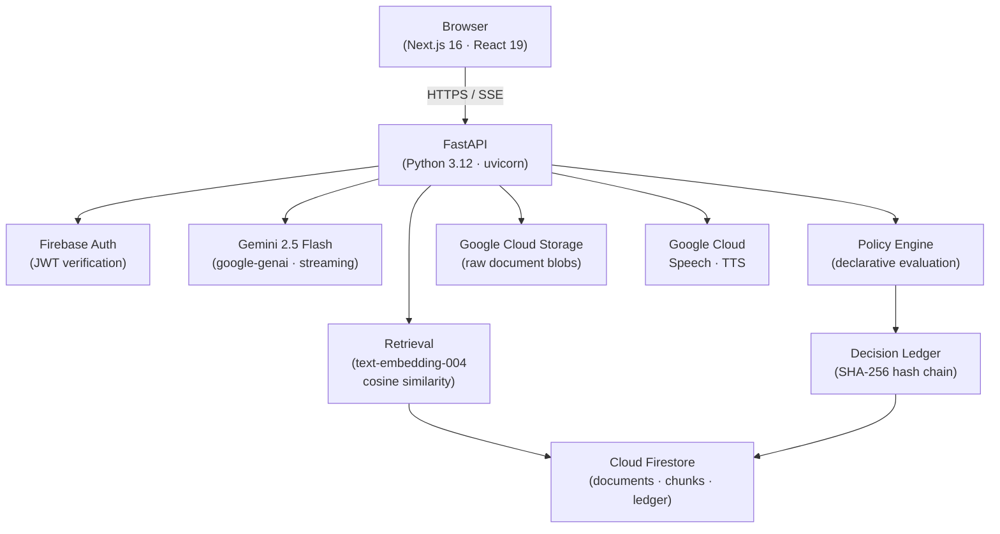
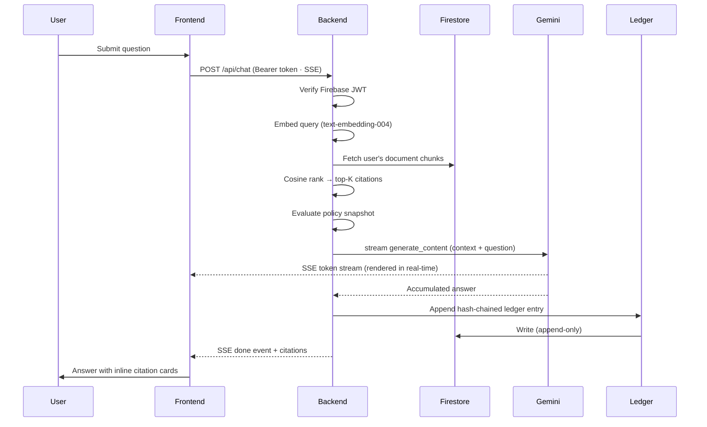

# Juris

**AI-powered legal research assistant with an immutable audit trail.**

[](LICENSE)
[](https://python.org)
[](https://nextjs.org)
[](#testing)
[](https://mypy-lang.org)

<br />

> *Replace with a product screenshot*
> `docs/assets/hero-placeholder.png`

---

## Why Juris?

Legal professionals operate under professional and regulatory obligations where AI outputs are not just answers — they are potential evidence, liability, and advice. Most AI tools are not built for this.

Juris solves two problems existing tools ignore:

**Provenance.** Every answer is grounded in documents the user uploaded. Every cited passage is traceable to the exact file, page, and chunk that produced it. The model never answers from training data alone.

**Accountability.** Every AI decision — the question, the retrieval set, the governing policy, and the answer — is written to an append-only, SHA-256 hash-chained ledger at the time it is made. That record cannot be altered after the fact. An attorney or compliance officer can reconstruct precisely what the system concluded, against what evidence, under what policy, at any point in time.

The goal is not a faster research tool. It is a research tool that can be trusted as a record system.

---

## Core Capabilities

| Capability | Description |
|---|---|
| **RAG over legal documents** | Upload PDF, DOCX, PPTX, XLSX, or plain text. Documents are chunked, embedded, and retrieved by cosine similarity at query time. |
| **Streaming responses** | Chat answers stream token-by-token over SSE. Citations are attached to each response. |
| **Source citations** | Every assistant response includes ranked citations with filename, page number (where available), and the exact retrieved passage. |
| **Voice input & output** | Dictate questions via browser microphone (Google Cloud STT). Answers are synthesised to audio on demand (Google Cloud TTS). |
| **AI Decision Ledger** | Append-only, hash-chained record of every AI decision stored in Firestore. Tamper-evident by construction. |
| **Policy Engine** | Declarative policy evaluation runs before generation. Policies can allow, warn, require approval, deny, or redact based on scope and conditions. |
| **Decision Timeline** | In-context desktop panel surfaces the ledger for the current conversation. |
| **Document context panel** | In-conversation panel showing which of the user's documents are available for retrieval. |
| **Dark-first workspace** | Accessible, keyboard-navigable interface built for extended professional use. |

---

## Demo

> *Replace with a screen recording or animated GIF*
> `docs/assets/demo-placeholder.gif`

---

## Architecture



---

## System Design

### Frontend

Next.js 16 App Router with React 19. State managed by Zustand. UI built on Tailwind CSS v4 and shadcn/ui (Base UI primitives). The workspace is a three-panel layout: sidebar navigation, conversation area, and optional context/timeline panels that open in-place.

### Backend

FastAPI application factory. All routes require a verified Firebase ID token. Request handlers are thin — business logic lives in services. Configuration is typed via Pydantic Settings and loaded from environment variables. A startup hook recovers documents left in `PROCESSING` state by crashed instances.

### Retrieval

Uploaded documents are parsed by [MarkItDown](https://github.com/microsoft/markitdown) (PDF, DOCX, PPTX, XLSX, plain text), split into overlapping token-bounded chunks, and embedded with Google's `text-embedding-004` model. Embeddings and chunk metadata are stored in Firestore. At query time, the question is embedded and chunks are ranked by cosine similarity. The top-K chunks above a configurable score threshold are injected into the prompt as context.

### Voice

Speech-to-text uses Google Cloud Speech (`latest_long` model, up to 120 seconds of audio). Text-to-speech synthesises assistant responses to MP3 on request. Both endpoints enforce per-request size and duration limits.

### AI Decision Ledger

Every completed AI response writes an entry to a per-user Firestore subcollection. Each entry includes the question, retrieval set with scores, model and prompt version, policy snapshot hash, answer hash, and a SHA-256 hash of the previous entry. The chain is verifiable from the genesis hash forward. Entries are never mutated or deleted.

### Policy Engine

Policies are declarative documents. Before generation, the engine evaluates the active policy snapshot against the conversation context and returns one of: `allow`, `warn`, `require_approval`, `deny`, or `redact`. The evaluation decision and policy snapshot are recorded in the ledger entry alongside the answer.

### Authentication

Firebase Authentication issues JWTs. The backend verifies every token via the Firebase Admin SDK. All Firestore and GCS operations are scoped by `owner_uid` extracted from the verified token. Cross-user data access is rejected at the service layer with a 403 before any data is read.

### Storage

Structured data (users, conversations, messages, document metadata, chunks, ledger entries) lives in Cloud Firestore. Raw document blobs live in Google Cloud Storage. The two are linked by document ID.

---

## Request Flow



---

## Repository Structure

```
juris/
├── backend/
│   ├── app/
│   │   ├── api/            # Route handlers: chat, conversations, documents, voice, ledger, users
│   │   ├── config/         # Typed settings (pydantic-settings)
│   │   ├── core/           # Firebase initialisation, auth dependency
│   │   ├── interfaces/     # Retrieval protocol definition
│   │   ├── models/         # Pydantic domain models: conversation, document, chunk, ledger, policy
│   │   ├── repositories/   # Firestore persistence: chunk_repo, ledger_repo
│   │   ├── services/       # Business logic: RAG, LLM, embedding, chunking, voice, policy, ledger
│   │   └── utils/          # Structured logging
│   └── tests/              # pytest + httpx async test suite (27 modules)
├── frontend/
│   ├── app/                # Next.js App Router pages
│   ├── components/
│   │   ├── conversation/   # MessageBubble, InputBar, CitationCard, PlayButton, DecisionTimeline
│   │   ├── layout/         # AppShell, SidebarDesktop, SidebarMobile, ContextPanel, TimelinePanel
│   │   └── ui/             # shadcn/ui primitives
│   ├── hooks/              # useConversation, useConversations, useAutoPlay, useRecorder
│   ├── lib/                # Firebase client, API helpers, nav config
│   ├── stores/             # Zustand: conversation store, sidebar store
│   └── types/              # Shared TypeScript interfaces
├── docs/
│   └── architecture/       # Per-milestone architecture design documents (M2–M6)
├── design-reviews/         # UI screenshots and design notes
└── docker-compose.yml
```

---

## Tech Stack

| Layer | Technology |
|---|---|
| Frontend framework | Next.js 16 (App Router), React 19 |
| Frontend language | TypeScript (strict) |
| Styling | Tailwind CSS v4, shadcn/ui (Base UI) |
| State management | Zustand |
| Icons | Phosphor Icons |
| Backend framework | FastAPI 0.115+ |
| Backend language | Python 3.12 |
| LLM | Gemini 2.5 Flash (`google-genai`) |
| Embeddings | `text-embedding-004` (Google) |
| Speech-to-text | Google Cloud Speech |
| Text-to-speech | Google Cloud Text-to-Speech |
| Document parsing | MarkItDown |
| Authentication | Firebase Authentication |
| Database | Cloud Firestore |
| File storage | Google Cloud Storage (Firebase Storage) |
| Containerisation | Docker, Docker Compose |
| Observability (optional) | Langfuse |

---

## Running Locally

### Prerequisites

- Python 3.12
- Node.js 20+
- A Firebase project with Authentication, Firestore, and Storage enabled
- A [Google AI Studio](https://aistudio.google.com) API key (Gemini + embeddings)
- A Google Cloud project with Speech-to-Text and Text-to-Speech APIs enabled (voice features)
- A Firebase service account credentials JSON file

### 1. Clone

```bash
git clone https://github.com/your-org/juris.git
cd juris
```

### 2. Backend

```bash
cd backend
python -m venv .venv && source .venv/bin/activate
pip install uv && uv sync
cp .env.example .env      # fill in values — see Environment Variables below
uvicorn app.main:app --reload --port 8001
```

API at `http://localhost:8001` · Interactive docs at `http://localhost:8001/docs`

### 3. Frontend

```bash
cd frontend
npm install
cp .env.local.example .env.local    # fill in values
npm run dev
```

App at `http://localhost:3000`

### Docker Compose

```bash
# From repo root — requires both .env files populated
docker-compose up --build
```

Frontend on `:3000`, backend on `:8000`.

---

## Environment Variables

### Backend (`backend/.env`)

| Variable | Required | Description |
|---|---|---|
| `GOOGLE_API_KEY` | Yes | Google AI Studio key for Gemini and embeddings |
| `FIREBASE_PROJECT_ID` | Yes | Firebase project ID |
| `FIREBASE_CREDENTIALS` | Yes | Path to service account JSON (e.g. `./firebase-credentials.json`) |
| `FIREBASE_STORAGE_BUCKET` | Yes | GCS bucket name (e.g. `your-project.appspot.com`) |
| `ENVIRONMENT` | No | `development` or `production` (default: `development`) |
| `LANGFUSE_SECRET_KEY` | No | Langfuse observability — no-op if unset |
| `LANGFUSE_PUBLIC_KEY` | No | Langfuse observability — no-op if unset |

Retrieval tuning (`chunk_size_tokens`, `retrieval_top_k`, `citation_score_threshold`), voice limits, and server configuration are documented in `backend/app/config/settings.py`.

### Frontend (`frontend/.env.local`)

| Variable | Required | Description |
|---|---|---|
| `NEXT_PUBLIC_FIREBASE_API_KEY` | Yes | Firebase web API key |
| `NEXT_PUBLIC_FIREBASE_AUTH_DOMAIN` | Yes | Firebase auth domain |
| `NEXT_PUBLIC_FIREBASE_PROJECT_ID` | Yes | Firebase project ID |
| `NEXT_PUBLIC_FIREBASE_STORAGE_BUCKET` | Yes | Firebase Storage bucket |
| `NEXT_PUBLIC_FIREBASE_MESSAGING_SENDER_ID` | Yes | Firebase messaging sender ID |
| `NEXT_PUBLIC_FIREBASE_APP_ID` | Yes | Firebase app ID |
| `NEXT_PUBLIC_BACKEND_URL` | Yes | Backend origin (e.g. `http://localhost:8001`) |

---

## Testing

### Backend

```bash
cd backend && source .venv/bin/activate

pytest                        # run all tests
mypy app                      # strict type checking
ruff check app tests          # linting
ruff format app tests         # formatting
```

The test suite uses `pytest-asyncio` and `httpx`. It covers API routes, service logic, repository behaviour, and integration scenarios across 27 test modules.

### Frontend

```bash
cd frontend

npm test                      # vitest — 130 tests across 14 files
npx tsc --noEmit              # type checking
npm run lint                  # ESLint
npm run build                 # production build verification
```

---

## Design Principles

1. **Show the evidence.** Every assistant answer cites its source passages. Every AI decision traces its retrieval set and policy. Transparency is the product, not a feature.

2. **Append-only for trust data.** The decision ledger is never mutated. Hash-chaining makes retrospective alteration detectable. A correction is a new entry, not an update.

3. **Strong typing end-to-end.** `mypy --strict` on the backend. TypeScript strict mode on the frontend. API response shapes are typed on both sides without runtime coercion.

4. **One pipeline, governed.** The policy engine is woven into the RAG/SSE flow as an evaluation point — not a separate execution branch. Governance is not opt-in.

5. **Streaming-first.** The chat endpoint emits SSE from the first token. There is no request that blocks on a complete response before rendering begins.

6. **Single storage engine.** Firestore for structured data, GCS for blobs. No additional databases. The system can be operated and reasoned about by a small team.

7. **Ownership at the service layer.** Every Firestore query is scoped by `owner_uid`. A user who presents a valid token but references another user's resource ID receives a 403 before any data is read.

---

## Performance Considerations

- **Embeddings are pre-computed.** Documents are embedded at upload time. Query-time retrieval is a Firestore read plus one embedding inference call for the question.
- **Retrieval is bounded.** Chunk injection is capped by `retrieval_top_k` (default: 5) and filtered by `citation_score_threshold` (default: 0.3).
- **Streaming reduces perceived latency.** The first token reaches the browser before generation completes.
- **Embedding calls are batched.** Chunk embeddings during document processing are batched to reduce API round-trips.
- **Stuck document recovery.** On startup the backend scans for documents left in `PROCESSING` from crashed instances and resets them, preventing permanently unprocessable uploads.

---

## Security

- All API endpoints require a Firebase JWT (`Authorization: Bearer <token>`). The token is verified on every request.
- `owner_uid` is extracted from the verified token only. It is never accepted from request bodies or URL parameters.
- Document, conversation, and ledger access all enforce ownership. Cross-user access returns 403.
- CORS origins are explicitly configured. Wildcard origins are not used in production.
- File uploads are validated for size and MIME type before being written to GCS.
- Service account credentials are excluded from version control via `.gitignore`.

---

## Screenshots

| Screen | |
|---|---|
| Conversation with citations | `docs/assets/screen-chat.png` |
| Document library | `docs/assets/screen-documents.png` |
| Decision Timeline panel | `docs/assets/screen-timeline.png` |
| Voice input | `docs/assets/screen-voice.png` |
| Mobile view | `docs/assets/screen-mobile.png` |

---

## Roadmap

### Current (implemented)

- RAG over user-uploaded documents with cosine retrieval
- Streaming chat with inline source citations
- Voice input (STT) and audio playback (TTS)
- AI Decision Ledger with SHA-256 hash chain
- Policy Engine evaluation in the chat pipeline
- Decision Timeline UI panel
- Firebase Authentication with per-user data scoping
- Docker Compose deployment

### Next

- Organisation (multi-tenant) boundaries for shared legal memory and org-wide audit
- Company Legal Memory — reusable institutional facts shared across conversations
- Ledger export

### Future

- Enterprise IdP federation (SAML / OIDC)
- Regional data residency
- Webhook outbox for external audit system integration

---

## Contributing

1. Fork the repository and create a branch from `main`.
2. **Backend changes:** `mypy app`, `ruff check app tests`, and `pytest` must all pass.
3. **Frontend changes:** `npx tsc --noEmit`, `npm run lint`, `npm test`, and `npm run build` must all pass.
4. Keep commits focused — one logical change per commit.
5. Document new environment variables in both the `.env.example` file and this README.
6. Do not commit secrets, service account credentials, or populated `.env` files.

---

## License

MIT — see [LICENSE](LICENSE).
